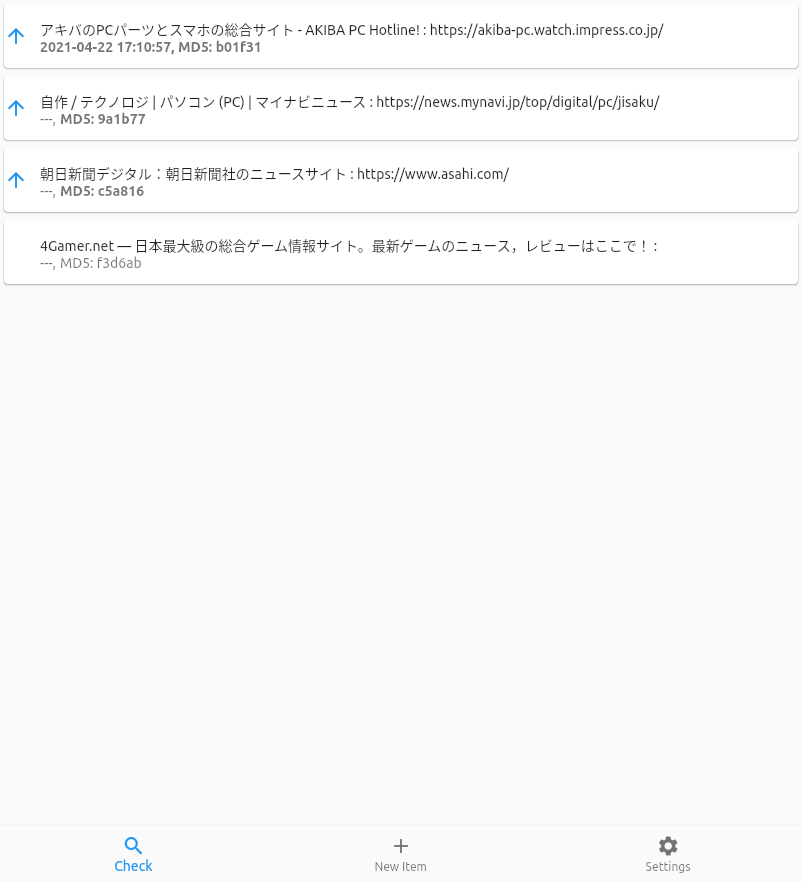
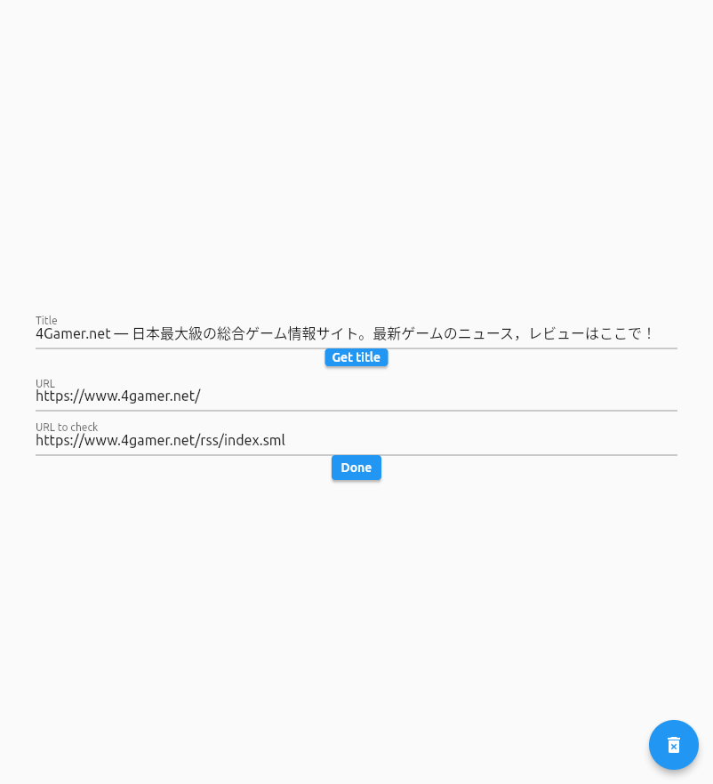

# weboscillo

This is a simple web checker application written in Flutter.

HTML written in UTF-8(ASCII) and Japanese charset(EUC/SJIS/JIS) will be correctly handled.

 

## License

Source codes under lib/ are AGPL-3.0.
Others are generated by flutter command and Android Studio.

## Source code

https://github.com/moonsightz/weboscillo
